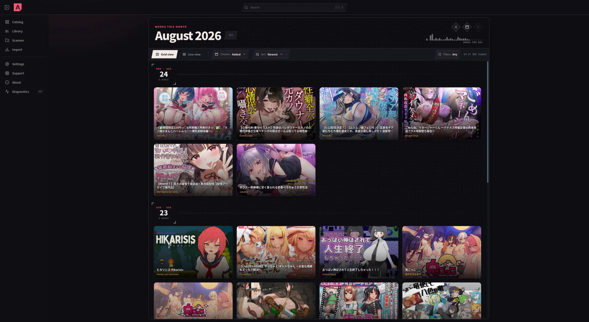
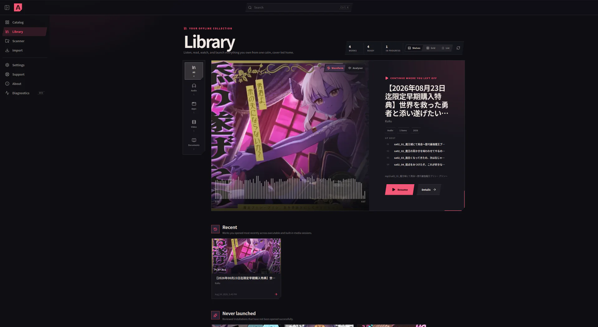
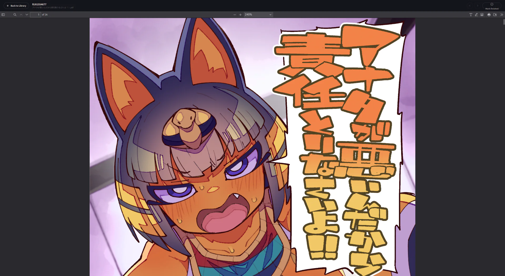

# DLA Launcher

DLA Launcher is an open-source, local-first catalog, library, scanner, reader,
player, and launcher for a user's DLsite works. It is built with Tauri 2, Rust,
React, TypeScript, Vite, TanStack, SQLite, and Tantivy.

This repository is the distributable product source. It contains no catalog
database, imported package, user library, ROM collection, or personal path.
The launcher creates empty local databases on first run. Catalog information is
added only when the user imports a `.dla` package, available from the
[DLA website](https://dlsitearchive.com/).

> DLA Launcher is pre-release software. Back up irreplaceable files and review
> destructive confirmations carefully.

## Screenshots

### Catalog



| Library | Built-in reader |
| --- | --- |
|  |  |

## Current capabilities

- Import and atomically switch versioned `.dla` catalog packages.
- Browse and search catalog data locally, including Japanese text.
- Scan user-selected folders and retain explainable matching evidence.
- Review, prepare, verify, relocate, repair, launch, and remove installations.
- Play supported local audio and video and read images and PDF documents.
- Handle read-only work deep links on desktop and Android.
- Inspect and install a user-selected standalone APK through Android's system
  confirmation flow, then associate, observe, and launch the installed app.
- Create bounded, path-redacted support reports for issue submissions.

Linux and Windows are the active desktop targets. Android has emulator-backed
runtime coverage. macOS and iOS are not currently release targets.

## Linux support

The supported Linux desktop baseline is x86_64 Debian 12 or Ubuntu 22.04 and
newer. Native Wayland and X11 sessions are tested. RPM builds for other modern
distributions are supported on a best-effort basis until each distribution
receives a native runtime gate.

AppImage distribution is temporarily withheld. The Tauri 2.11 AppImage bundler
mixes build-host GLib, Wayland, and GStreamer libraries with newer host graphics
stacks, which can leave a blank window on current Mesa systems. AppImage will
return only after the upstream incompatibility is resolved and the artifact
passes launch and multimedia gates on both the supported baseline and a current
Wayland system.

DLA Launcher requires a graphical Wayland or X11-compatible session; headless
and direct-framebuffer systems are not supported. GTK selects the available
display backend automatically, and WebKitGTK GPU compositing remains enabled by
default. Users should launch the installed application normally rather than
setting `GDK_BACKEND` or disabling compositing.

## Build from source

Install the platform prerequisites in [Building](docs/BUILDING.md), then:

```bash
git clone https://github.com/DLA-Project/dla-launcher.git
cd dla-launcher
corepack enable
pnpm install --frozen-lockfile
cargo install tauri-cli --version 2.11.4 --locked
cd tauri2
cargo tauri dev
```

Build a native package on the target operating system:

```bash
cd tauri2
cargo tauri build --ci
```

Windows produces MSI and NSIS installers. Linux produces DEB and RPM packages;
AppImage is currently excluded by the Linux release configuration. Android
setup and release signing are documented in [Building](docs/BUILDING.md#android).

## Verify a change

```bash
pnpm install --frozen-lockfile
pnpm test
pnpm typecheck
pnpm build
cd tauri2
cargo fmt --all --check
cargo test --workspace
cargo clippy --workspace --all-targets -- -D warnings
cargo tauri build --ci --no-bundle
```

Platform-specific runtime checks remain necessary; a cross-compile alone does
not prove that native dialogs, storage, launch, media, or Android flows work.

## Repository layout

```text
shared/ui/           Framework-neutral React product UI and localization
shared/contracts/    Versioned interchange and application schemas
shared/fixtures/     Synthetic, test-only contract and media fixtures
tauri2/crates/       Rust domain, application, and adapter crates
tauri2/src-tauri/    Tauri composition root and platform configuration
tauri2/ui/           Thin Tauri frontend gateway and router
tauri2/tests/        Native Android test applications
docs/                Public build documentation
```

Read [Contributing](CONTRIBUTING.md) before submitting a patch.

## Privacy and project independence

DLA Launcher is designed to keep catalog, library, preferences, notes, media
progress, and scan evidence on the user's device. Support bundles are created
only on request, are bounded, redact known local paths, and should still be
reviewed before upload.

DLsite is a trademark of its respective owner. DLA Launcher and DLA Project are
independent community projects and are not affiliated with or endorsed by
DLsite or EISYS.

## License

Copyright (C) 2026 DLA Project contributors.

The source is licensed under the GNU Affero General Public License v3.0 only.
See [LICENSE](LICENSE) and [NOTICE](NOTICE).
